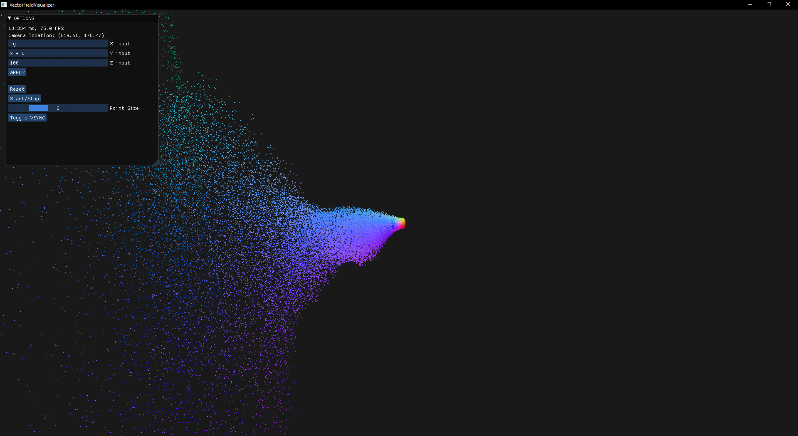

# Vector-Field-Visualizer (WIP)
A 3d vector field visualizer that uses compute shaders to simulate thousands of particles.

# Screenshots

# Controls
- Mouse wheel to zoom in/out
- Click and drag to look around

# Notes
- The input parameters for x, y, z all use GLSL syntax, so operators like ^ for exponents wont work and functions like pow() should be used instead.
- When running the compiled exe, make sure the `resources` folder is in the same directory as the .exe, otherwise the shaders won't compile.

# TODO
- Add xyz axis visual
- add input error checking/handling
- fix camera dragging issues

# Libraries used
* [GLFW](https://www.glfw.org/) - OpenGL context and window creation
* [ImGui](https://github.com/ocornut/imgui) - GUI library
* [GLAD](https://github.com/Dav1dde/glad) - OpenGL Loader-Generator
